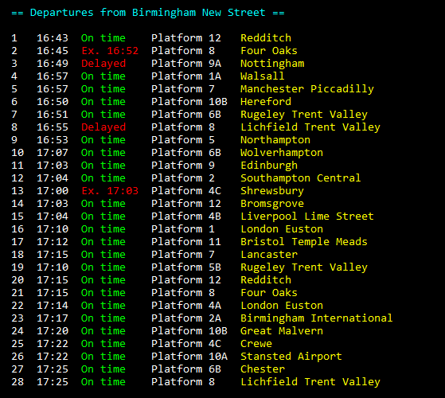

# PyTrains

PyTrains is a simple Python library and command-line interface to obtain realtime UK train information through [Worldline's "Tiger" train API](http://iris2.rail.co.uk/tiger/), which is unfortunately undocumented, making this library very difficult to create and maintain!

## Command Line Interface
```
pytrains <station name or CRS code>
```

The command line interface is very high level and intuitive, allowing you to simply enter the name of the station or its CRS code and recieve a detailed breakdown of services from the specified station. For example, if I were to find train services from Birmingham New Street, I could enter either `pytrains bhm` or `pytrains Birmingham New Street` (both case-insensitive) to see a list of departures. If I want more information about a specific service, I can type in the ID (the number on the far left) and press ENTER, which will tell me limited information about the service's calling points, along with some information about carriages and status. On the left is an example output of this.

## Use as a Python Module [(Full Documentation)](DOCUMENTATION.md)
PyTrains can also be imported and used as a Python module with easy-to-understand syntax. Here's a very simple example program to get you going:
```py
import pytrains

station = pytrains.Station("BHM")

print("The next train from {} is the {} to {}.".format(
    station.name,
    station.services[0].departureTime.strftime("%H:%M"),
    station.services[0].destination
))
# Sample output: The next train from Birmingham New Street is the 16:45 to Four Oaks.

print("It has {} carriages, is delayed by {} minutes, and will be on Platform {}.".format(
    station.services[0].carriageCount,
    station.services[0].delay,
    station.services[0].platform
))
# Sample output: It has 6 carriages, is delayed by 9 minutes, and will be on Platform 8.
```

This is just scratching the surface of what PyTrains is capable of, so make sure to have a browse of the documentation to learn about its full capabilities.

## How to Install

### Install from PyPI:
Just run `pip install pytrains` to install. Dependencies will be automatically installed.

### Install manually
1. Clone the repo: `git clone https://github.com/w-henderson/PyTrains`
2. Navigate to its directory: `cd PyTrains`
3. Install dependencies: `pip install -r requirements.txt`
4. Install the package: `python setup.py install`